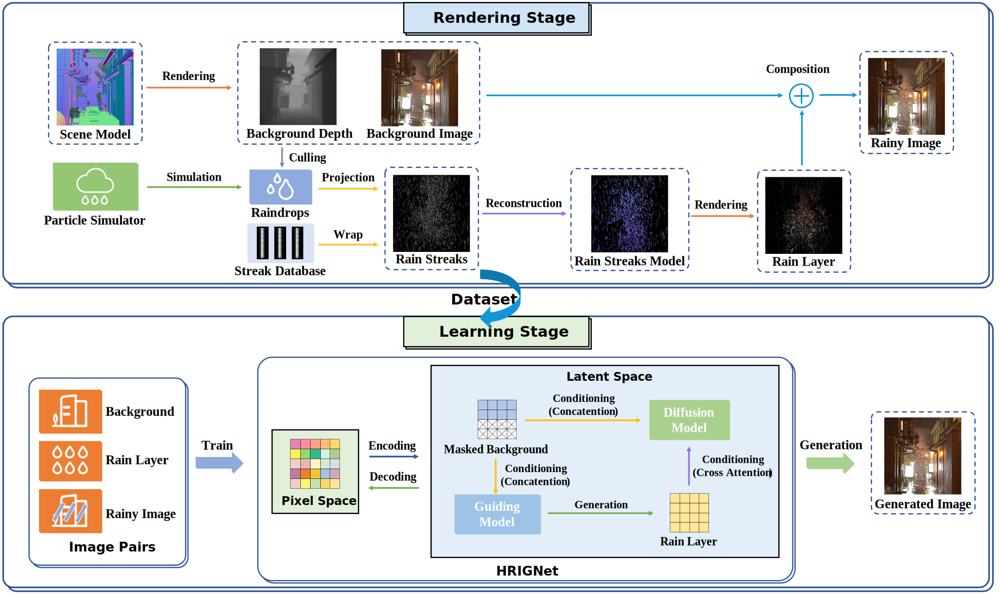

## High-resolution Rainy Image Synthesis: Learning from Rendering

Kaibin Zhou, Shengjie Zhao, Hao Deng, Lin Zhang

School of Software Engineering, Tongji University, Shanghai, China

---

### Introduction

This is the website for our paper "High-resolution Rainy Image Synthesis: Learning from Rendering".

---

### Source Codes and Data

* Get the codes: [Github](https://github.com/kb824999404/HRIG)
* Get the HRI dataset and the Blender scene files: [Google Drive](https://drive.google.com/drive/folders/1MSS-iNaLxI05K_10pHMWYibrDJtMJngP?usp=sharing), [Baidu Cloud](https://pan.baidu.com/s/14G4fE8_7lswvod6OtIbOew?pwd=v9b2)(Extraction Code: v9b2)

---

Last update: Jan. 28, 2024    